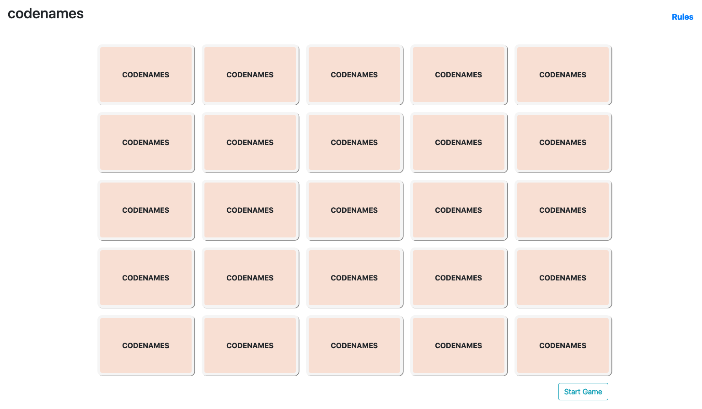

# **Codenames**
## ABOUT
codenames is an online game based off the popular board game by Czech Games. This allows for friends to play together on the same board and was built of necessity during these trying coronavirus times to stave off boredom. Virtual social interaction counts! This game works best on desktops or landscape on tablets.

_Adapted from this [official game.](https://czechgames.com/files/rules/codenames-rules-en.pdf)_
_Click [HERE](https://codenames-ga.herokuapp.com/) for deployed app._


## Initial Configuration & Installation
1. Fork this project via github.
2. Run `npm install` to install dependencies.
3. Use `nodemon` to launch this in your browser. Runs locally on port 3000.


## Built with the following:
```bash
HTML, CSS/Bootstrap, JS, Express and Socket.io
```

## Functions and future features
* This was built initially as a game to be shared with players in the same room, passing around the board on a single device. After the initial iteration, the functionality was extended for bi-directional real time display of moves when players click on a word. 
* Currently players can: 
    * Start a new game and words will be synced across all devices using the link. All 400 words will be shuffled and 25 will be displayed each round.
    * Toggle between spymaster/player mode.
    * If all correct guesses have been made, the playing team can pass turn to opposing team.
    * If a bystander or opposing team's card is selected, the turn will automatically pass to the other team.
    * If an assassin card is selected, game will end automatically.
    
* Future functionality could include: 
    * Different rooms for multiple groups to play separately and identification of players on each team.
    * Themed versions of the game (e.g. Harry Potter) or other language support

## Screenshots of game play
**Starting screen**

---
**Spymaster view**

---
**Game in play**

---


## Shoutouts!
Thanks to Jackson Owens (https://github.com/jbowens) for the words list!

